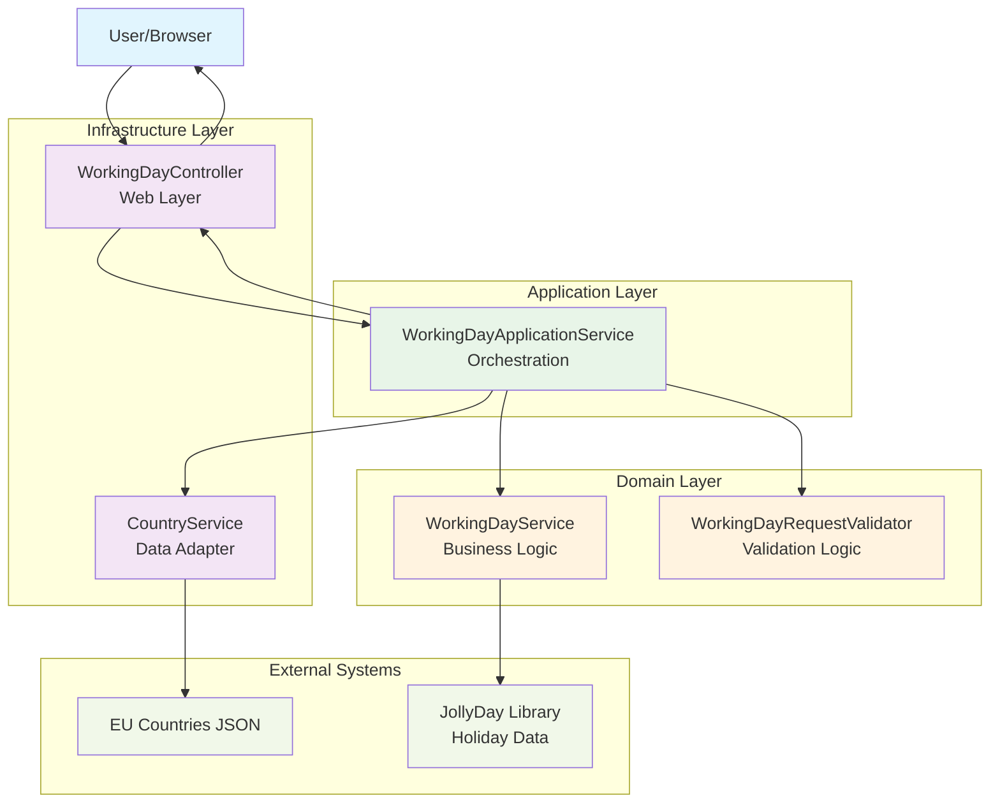

# Working Day Calculator (Clean Architecture)

A Spring Boot 4 application demonstrating SOLID principles and clean architecture to calculate working days (Monday-Friday) between two dates, excluding weekends and public holidays.

## Current Status

✅ **Spring Boot 4.0.2** - Successfully migrated to latest stable version  
✅ **Jakarta EE 11** - Full compliance with modern Jakarta namespaces  
✅ **Jackson 3.0.4** - Latest JSON processing with compatibility layer  
✅ **All Tests Passing** - 50 tests passing with full functionality  
✅ **Modern Stack** - Updated to latest dependency versions

## Architecture Overview

### UML Class Diagram


### Request Flow Sequence Diagram


### Error Handling Flow


### Architecture Overview



### Hexagonal Architecture (Ports and Adapters)
- **Domain Layer**: Core business logic with use cases and domain models
- **Application Layer**: Orchestrates domain use cases and provides application services
- **Infrastructure Layer**: Adapters for external systems (web, data persistence)
- **Domain Ports**: Interfaces defining contracts for infrastructure

### Package Structure
```
com.example.calculator/
├── domain/
│   ├── model/           # Domain models (Country, WorkingDayResult, WorkingDayError, ValidationResult)
│   ├── port/            # Domain ports (interfaces)
│   │   ├── CountryRepository
│   │   ├── WorkingDayCalculator
│   │   └── RequestValidator
│   ├── exception/        # Domain exceptions
│   └── usecase/          # Business use cases
│       ├── WorkingDayService
│       └── WorkingDayRequestValidator
├── application/
│   └── service/         # Application services (orchestration)
│       └── WorkingDayApplicationService
└── infrastructure/
    ├── adapter/           # Infrastructure adapters
    │   └── CountryService
    └── web/              # Web layer
        └── WorkingDayController
```

## SOLID Compliance

- **SRP**: Each class has a single responsibility
  - `WorkingDayService`: Core calculation logic
  - `WorkingDayRequestValidator`: Input validation
  - `WorkingDayApplicationService`: Orchestration of domain services
  - `WorkingDayController`: HTTP request/response handling
  - `CountryService`: Data access abstraction

- **OCP**: Open for extension without modification
  - New calculation methods can be added to `WorkingDayCalculator` interface
  - New validation rules can extend `RequestValidator` interface
  - New data sources can implement `CountryRepository` interface

- **LSP**: Subtypes can replace base types
  - `CountryServiceAdapter` implements `CountryRepository` interface
  - Custom exceptions extend `RuntimeException`

- **ISP**: Clients depend on interfaces they use
  - Controller depends on `WorkingDayApplicationService` interface
  - Application service depends on domain ports, not concrete implementations

- **DIP**: Depends on abstractions, not concretions
  - Application service depends on `WorkingDayCalculator` and `CountryRepository` interfaces
  - Controller depends on application service interface

## API Specification

### Endpoints
- `GET /`: Returns HTML form for date input with country selection
- `GET /calculate?start=YYYY-MM-DD&end=YYYY-MM-DD&country=XX`: 
  - Validates input parameters
  - Calculates working days excluding weekends and holidays
  - Returns result page with calculation details

### Response Format
- **Success**: HTML page with calculation result, input dates, and country info
- **Validation Errors**: Redirect with flash attributes:
  - `error`: Human-readable error message
  - `errorCode`: Structured error code (e.g., "DATE_001", "COUNTRY_001")

## Features

### Core Functionality
- **Working Day Calculation**: Monday-Friday calculation excluding weekends
- **Holiday Integration**: Uses JollyDay library for public holidays by country
- **Input Validation**: Comprehensive date range and country validation
- **Error Handling**: Structured error codes with user-friendly messages
- **Clean Architecture**: Hexagonal architecture with clear separation of concerns

### Validation Rules
- **Date Range**: Must be between 1900-01-01 and 2100-12-31
- **Date Logic**: Start date cannot be after end date
- **Country Validation**: Must be valid country code from loaded countries
- **Required Fields**: All input parameters are required

### Error Codes
- `DATE_001`: Start date cannot be after end date
- `DATE_002`: Date range must be between 1900-01-01 and 2100-12-31
- `COUNTRY_001`: Invalid country selected

## Technology Stack

- **Framework**: Spring Boot 4.0.2
- **Java**: 17+
- **Build**: Maven 3.6+
- **Testing**: JUnit 6 (Jupiter)
- **Templating**: Thymeleaf 3.1.3
- **Holiday Data**: JollyDay 1.8.2 (Jakarta EE 11 compatible)
- **JSON Processing**: Jackson 3.0.4 with Jackson 2.20.2 compatibility layer
- **Code Quality**: Lombok 1.18.42
- **Jakarta EE**: 11 compliance with Servlet 6.1

## Deployment Instructions

### Prerequisites
- Docker installed
- Maven 3.6+
- Java 17+

### Option 1: Using Maven
```bash
mvn spring-boot:run
```
Access application at: http://localhost:8080

### Option 2: Using Docker
```bash
docker build -t working-day-calc .
docker run -p 8080:8080 working-day-calc
```
Access application at: http://localhost:8080

## Testing

### Test Coverage
- **Unit Tests**: Domain logic, validation, and application services
- **Integration Tests**: Full web layer testing with MockMvc
- **Adapter Tests**: Infrastructure component testing

### Running Tests
```bash
# Run all tests
mvn test

# Run specific test class
mvn test -Dtest=WorkingDayServiceTest

# Run integration tests only
mvn test -Dtest=WorkingDayControllerIT
```

## Code Quality

### SonarQube Compliance
- No duplicate methods
- No redundant object instantiation
- Clean exception handling
- Proper test assertions
- Meaningful test coverage

### Best Practices Applied
- **Immutable domain objects** with Lombok
- **Builder pattern** for complex object construction
- **Structured error handling** with custom exception types
- **Dependency injection** via constructors
- **Clean separation** of concerns across layers

## Recent Improvements

### v2.0 - Clean Architecture Refactor
- **Hexagonal Architecture**: Implemented ports and adapters pattern
- **Domain Services**: Separated business logic from infrastructure
- **Application Layer**: Added orchestration services
- **Structured Errors**: Implemented error codes with enum
- **Builder Pattern**: Added for complex object construction
- **Enhanced Testing**: Comprehensive test coverage
- **Code Quality**: Removed SonarQube warnings

### v2.1 - Exception Handling Enhancement
- **WorkingDayException**: Custom domain exception
- **WorkingDayError**: Structured error codes
- **ValidationResult**: Type-safe validation result
- **Error Codes**: Consistent error categorization

### v3.0 - Spring Boot 4 Migration
- **Spring Boot 4.0.2**: Latest stable version with modern features
- **Jackson 3 Migration**: Upgraded to Jackson 3.0.4 with compatibility layer
- **Jakarta EE 11**: Full migration from javax to jakarta namespaces
- **JollyDay Upgrade**: Migrated to de.focus-shift with Jakarta support
- **Test Dependencies**: Updated to Spring Boot 4 webmvc test modules
- **Security Updates**: Latest security patches and performance improvements
- **Servlet 6.1**: Updated to latest servlet specification

### v2.2 - UI/UX Improvements
- **Dynamic Result Display**: Result div shows/hides based on calculation state using `th:if`
- **Form Reset**: Reset button clears all fields and hides results
- **Country Selection Persistence**: Selected country preserved after calculation
- **Error Display**: Flash attributes for error messages with structured error codes
- **Thymeleaf Optimization**: Improved conditional rendering for better reliability

## Migration Notes

### Spring Boot 3.5.10 → 4.0.2 Migration

**Key Changes Made:**
- **Jackson Migration**: Added `spring-boot-jackson2` compatibility module for smooth transition
- **Test Dependencies**: Updated to `spring-boot-webmvc-test` for `@AutoConfigureMockMvc`
- **JollyDay Upgrade**: Migrated from `de.jollyday` to `de.focus-shift` with Jakarta EE 11 support
- **Package Updates**: Updated imports for new Spring Boot 4 package structure
- **Jakarta Namespaces**: Full migration from `javax.*` to `jakarta.*`

**Breaking Changes Addressed:**
- `@AutoConfigureMockMvc` moved to `org.springframework.boot.webmvc.test.autoconfigure`
- Jackson 3.0.4 default with Jackson 2.20.2 compatibility layer
- JAXB updated to Jakarta XML Binding
- Servlet 6.1 baseline requirements

**Compatibility Strategy:**
- Used Jackson 2 compatibility module to maintain existing functionality
- Added both Jakarta and javax JAXB implementations during transition
- Maintained backward compatibility for holiday calculations

## Repository

https://github.com/Helderpm/ai_exec.git

## Contributing

1. Follow SOLID principles
2. Maintain clean architecture boundaries
3. Add comprehensive tests for new features
4. Use structured error handling
5. Keep code SonarQube compliant
